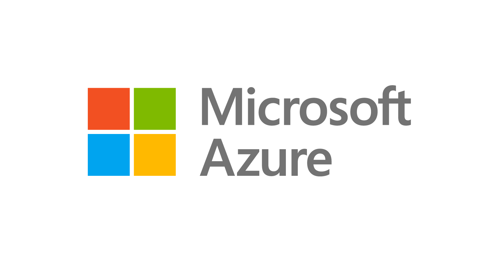

# Module  

## Submodule  

Content of the submodule   

  


## Follow along  

### Practice topic  

- Example: Create an User and a Group 

```
Azure Active Directory
├ Users
| └ New user
|   ├ [X] Create user 
|   ├ Email: brian@cagoucoding.onmicrosoft.com
|   ├ Name: Brian Cagoucoding
|   ├ First name: Brian
|   ├ Last name: Cagoucoding
|   ├ Groups: select the group -> developers
|   ├ Roles: select the role -> Application developer
|   └ Additionnal info: ...
└ Groups
  └ New group
    ├ Group type: Security
    ├ Group name: developers
    └ Group description: Developers of Cagou Coding
```

## Exercises  

> **_TODO_**: Do and document these exercises  

- Exercise - [Add and delete users in Azure Active Directory](https://docs.microsoft.com/en-us/learn/modules/create-users-and-groups-in-azure-active-directory/3-exercise-add-delete-users-azure-ad)  

- Knowledge check - [What is Azure RBAC?](https://docs.microsoft.com/en-us/learn/modules/secure-azure-resources-with-rbac/3-knowledge-check-rbac-overview)  
