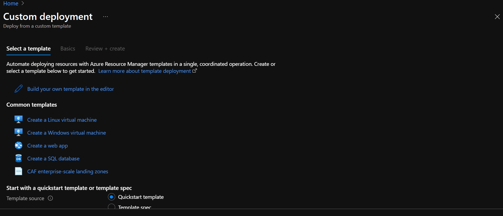

# ARM Templates  

## Intro  

JSON files that define Azure resources:  
- declarative (get exactly what you define)  
- stand up, tear down or share entire architectures in minutes  
- reduce config mistakes  
- establish an architecture baseline for compliance  
- **Modularity**: break up your architecture in multiple files and reuse them  
- **Extensibility**: add PowerShell and Bash scripts to your templates  
- **Testing**: use the ARM template tool kit  
- **Preview Changes**: before infra creation, see what it will create  
- **Built-In validation**: only deploy ARM template if it passes  
- **Track Deployments**: keep track of changes to architecture over time  
- **Policy as Code**: apply Azure Policies to ensure remain compliant  
- **CI/CD integration**  
- **Exportable code**  
- **Authoring tools**: Vscode has advanced features for authoring ARM Templates  

## ARM Template Skeleton  

- `$schema` describes the structure of JSON data  
- `contentVersion` is the version of the template  
- `apiProfile` (optional) for avoiding to specify API versions for each resource in the template  
- `parameters` (optional) are values you can pass along to your template  
- `variables` (optional) transform parameters or resource properties using function expressions  
- `functions` (optional) are user-defined functions available within the template  
- `resources` are the wanted Azure resources to deploy or update  
- `output` (optional) is the values that are returned after deployment  

### Resources  

```json
{
   "$schema": "...",
   "contentVersion": "...",
   "apiProfile": "",
   "parameters": {},
   "variables": {},
   "functions": [],
   "resources": [
      {
          "type": "Microsoft.Storage/storageAccounts",
          "apiVersion": "2019-06-01",
          "name": "learntemplatestorage123",
          "location": "westus",
          "sku": {
              "name": "Standard_LRS"
          },
          "kind": "StorageV2",
          "properties": {
              "supportsHttpsTrafficOnly": true
          }
      }
   ],
   "outputs": {}
}
```

### Parameters  

```json
{
   "$schema": "...",
   "contentVersion": "...",
   "apiProfile": "",
   "parameters": {
     "storageName": {
       "type": "string",
       "defaultValue": "mystorage-fr",
       "minLength": 5,
       "maxLength":20
     }
   },
   "variables": {},
   "functions": [],
   "resources": [
      {
          "type": "Microsoft.Storage/storageAccounts",
          "apiVersion": "2019-06-01",
          "name": "[parameters('storageName')]",
          "location": "westus",
          "sku": {
              "name": "Standard_LRS"
          },
          "kind": "StorageV2",
          "properties": {
              "supportsHttpsTrafficOnly": true
          }
      }
   ],
   "outputs": {}
}
```

### Functions  

- Template functions: built-in functions  
  - Array  
  - Comparison  
  - Date  
  - Deployment  
  - Logical  
  - Numeric  
  - Object  
  - Resource  
  - String  
- User-Defined functions  

Functions are called using `()`  

```json
{
   "$schema": "...",
   "contentVersion": "...",
   "apiProfile": "",
   "parameters": {
     "storageName": {
       "type": "string",
       "defaultValue": "mystorage-fr",
       "minLength": 5,
       "maxLength":20
     }
   },
   "variables": {},
   "functions": [],
   "resources": [
      {
          "type": "Microsoft.Storage/storageAccounts",
          "apiVersion": "2019-06-01",
          "name": "[parameters('storageName')]",
          "location": "[if(contains(parameters('storageName'), '-fr'), 'centralfrance', 'westeurope')]",
          "sku": {
              "name": "Standard_LRS"
          },
          "kind": "StorageV2",
          "properties": {
              "supportsHttpsTrafficOnly": true
          }
      }
   ],
   "outputs": {}
}
```

### Variables  

```json
{
   "$schema": "...",
   "contentVersion": "...",
   "apiProfile": "",
   "parameters": {
     "storageName": {
       "type": "string",
       "defaultValue": "mystorage-fr",
       "minLength": 5,
       "maxLength":20
     }
   },
   "variables": {
     "defaultLocations": {
       "france": "centralfrance",
       "europe": "westeurope"
     }
   },
   "functions": [],
   "resources": [
      {
          "type": "Microsoft.Storage/storageAccounts",
          "apiVersion": "2019-06-01",
          "name": "[parameters('storageName')]",
          "location": "[if(contains(parameters('storageName'), '-fr'), [variables('defaultLocations')].france, [variables('defaultLocations')].europe)]",
          "sku": {
              "name": "Standard_LRS"
          },
          "kind": "StorageV2",
          "properties": {
              "supportsHttpsTrafficOnly": true
          }
      }
   ],
   "outputs": {}
}
```

### Output  

```json
{
   "$schema": "...",
   "contentVersion": "...",
   "apiProfile": "",
   "parameters": {
     "storageName": {
       "type": "string",
       "defaultValue": "mystorage-fr",
       "minLength": 5,
       "maxLength":20
     }
   },
   "variables": {
     "defaultLocations": {
       "france": "centralfrance",
       "europe": "westeurope"
     }
   },
   "functions": [],
   "resources": [
      {
          "type": "Microsoft.Storage/storageAccounts",
          "apiVersion": "2019-06-01",
          "name": "[parameters('storageName')]",
          "location": "[if(contains(parameters('storageName'), '-fr'), [variables('defaultLocations')].france, [variables('defaultLocations')].europe)]",
          "sku": {
              "name": "Standard_LRS"
          },
          "kind": "StorageV2",
          "properties": {
              "supportsHttpsTrafficOnly": true
          }
      }
   ],
   "outputs": {
     "resourceID": {
       "type": "string",
       "value": "[resourceId('Microsoft.Storage/storageAccounts', parameters('storageName'))]"
     }
   }
}
```

## Follow along  

### Launch an ARM template  

- In the portal, go to the following section

```
Deploy a custom template
└ Build your own template in the editor
  └ Add resource
    └ Select a resource to the template
      └ Ubuntu virtual machine
```

- modify the variables if needed  

  

## Exercises  

- Exercise - [Create and deploy an Azure Resource Manager template](https://docs.microsoft.com/en-us/learn/modules/create-azure-resource-manager-template-vs-code/3-exercise-create-and-deploy-template?pivots=cli)  

- Exercise - [Add parameters and outputs to your Azure Resource Manager template](https://docs.microsoft.com/en-us/learn/modules/create-azure-resource-manager-template-vs-code/5-exercise-parameters-output?pivots=cli)  

- Knowledge check - [ARM Templates](https://docs.microsoft.com/en-us/learn/modules/create-azure-resource-manager-template-vs-code/6-knowledge-check)  

