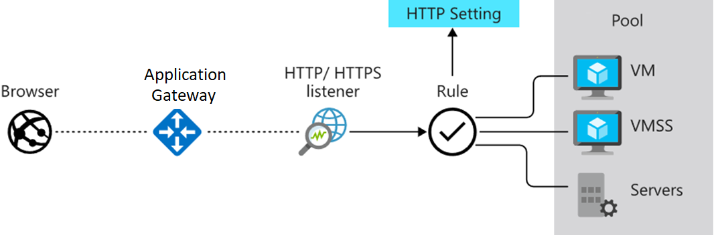

# Azure Application Gateway  

## Intro  

Application-level routing and load balancing service that operates on 
OSI layer 7  

  

**Azure Web Application Firewall (WAF)** policies can be attached to an 
Application Gateway to provide additional security  

For setting up:  

- Frontends  
  - private IP  
  - public IP  

- Backends  
  - backend pool  
    - colleciton of resources to which your application gateway can send traffic  
    - can contain  
      - VMs  
      - VM scale sets  
      - IP addresses  
      - domain names  
      - App Service  

- Routing rules  

  

### Routing rules  

- Listeners  
  - listens on a specified port and IP address  
  - 2 types  
    - Basic: forward all requests for any domain to backend pools  
    - Multi-site: forward requests to different backend pools based on host header and host name  
  - requests are matched according to the order of the rules  

- Backend targets: chooses where a route should go either Backend Pool or Redirection  

- HTTP Settings: defines how we want to handle cookies, connection draining, port request time, ...  

## Exercises  

> **_TODO_**: Do and document these exercises  

- Knowledge check - [ Configure Azure Application Gateway](https://docs.microsoft.com/en-us/learn/modules/configure-azure-application-gateway/5-knowledge-check)  
