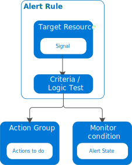

# Azure Monitor  

## Intro  

Collecting, analyzing and acting on telemetry  

## Pillars of Observability  

  

- Metrics: number that is measured over period of time  

- Logs: text file where each line contains event data  

- Traces: history of request that is travels through multiple apps/services  

## Anatomy of Azure Monitor  

  

*sources of data* -> *data stores* -> *functions*  

## Sources (data types)  

- Application code: performance and functionality of application and code    

- Guest OS  

- Azure resources: internal operation of an Azure Resource  

- Azure subscription: service health  

- Azure tenant: operation of tenant-level as AAD  

- Custom  

## Data Stores  

Azure Monitor collects two fundamental type of data from sources:  

- Azure Monitor Logs  
  - collects and organizes logs and perf data  
  - are consolidated into workspaces  
  - works with log queries and the results using **Log Analytics**  

- Azure Monitor Metrics  
  - collects numeric data from monitored resources into a time series database  
  - lightweight and supporting near real-time scenarios (useful for alerting)  
  - can be analyzed using **Metrics Explorer**  

## Log Analytics  

To edit and run log queries with data in Azure Monitor Logs  

### Log Analytics workspaces  

An unique environment for Azure Monitor log data  

### Kusto and Kusto Query Language (KQL)  

Kusto is based on relational databse management systems  

Logs queries are written the KQL  

#### Kusto Entities  

- Clusters  
- Databases  
- Tables  
- Columns  
- Functions  

#### Kusto Scalar Data types  

Scalars are quantities that are fully described by a magnitude (or numerical value)  

Data type defines how a piece of data is interpreted  

#### Kusto Control Commands  

Can modify data and metadata and has it own syntax different from KQL  

Example:  
```
.show tables
| count
```

#### Kusto Functions  

- Stored Functions  

- Query-defined Functions  

- Built-in Functions  

#### Kusto Scalar Operators  

- Bitwise (binary)  

- Logical (binary) 

- Datetime / timespan arithmetic  

- Numerical  

- String  


#### Kusto Tabular Operators  

- `count`: returns the count of rows in the table  

```
StormEvents | count
```

- `take`: returns up to the specified number of rows of data  

```
StormEvents | take 5
```

- `where`: filters a table to the subset of rows that satisfy a predicate  

```
StormEvents 
| where EventType == "Snow"
```

- `sort`: sort the rows  

```
StormEvents 
| where EventType == "Snow"
| sort by Intensity desc
```

- `project`: returns a specific set of columns  

```
StormEvents 
| take 5
| project StartTime, EndTime, State, EventType
```

- `top`  

- `extend`: creates a new column by computing a value    

```
StormEvents 
| where EventType == "Snow"
| sort by Intensity desc
| extend Duration = EndTime - StartTime
| project StartTime, EndTime, State, EventType
```

- `summarize`: aggregates groups of row  

- `render`: renders results as a graphical output  

## Metrics Explorer  

Plot charts, visualize correlating trends and investigate spikes and dips in metrics values  

To visualize a metric you need to define:  

- scope  
- namespace  
- metric  
- aggregation  

## Azure Alerts  

For notifying you when issues are found with your infrastructure or app  

3 types of alerts:  

- Metrics Alerts  
- Log Alerts  
- Activity Logs Alerts  

  

## Azure Dashboards  

Virtual workspaces to quickly launch tasks for day-to-day operations 
and monitor resources  

## Azure Workbooks  

**It tells a story about the performance and availability about your applications 
and services**  

## Application Insights  

Application Performance Management (APM) service  

Use cases:  
- automatically detect perf anomalies  
- includdes powerful analytics tools to help you diagnose issues 
and to understand what users do with your app  
- designed to help you continuously improve perf and usability  
- integrates with your DevOps process  
- can monitor and analyze telemetry from mobile apps  
