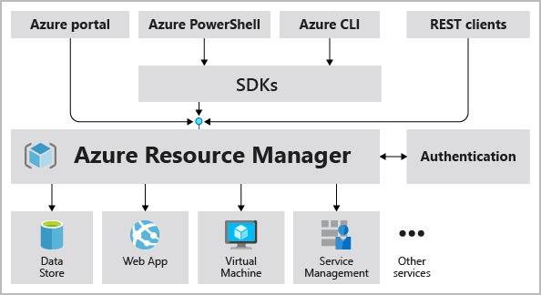

# Introduction to Azure fundamentals

[source](https://docs.microsoft.com/en-us/learn/modules/intro-to-azure-fundamentals)

## Introduction

### Domain areas

AZ-900 Domain Area | Weight
--- | ---
Describe cloud concepts | 20-25%
Describe core Azure services | 15-20%
Describe core solutions and management tools on Azure | 10-15%
Describe general security and network security features | 10-15%
Describe identity, governance, privacy, and compliance features | 20-25%
Describe Azure cost management and Service Level Agreements | 10-15%

## What is cloud computing?

- Cheaper because *pay-as-you-go*  
  - lower operation costs  
  - run infra more efficiently  
  - more scalable  

## What is Azure?

- 100 services  
- [Azure portal](https://portal.azure.com/): Web based portal to manage all Azure services  
- [Azure markerplace](https://azuremarketplace.microsoft.com/): on-demand solutions and services  

## Tour of Azure services

- Compute: VM, Kubernetes, Functions  
- Networking: Virtual network, DNS, VPN, Loadbalancers
- Storage: BLOB, File storage  
- Mobile: Android / iOS backend  
- Database: Cosmos DB, SQL, MySQL, PostgreSQL  
- Web: web hosting  
- IoT: IoT software or edge  
- Big Data: Synapse Analytics, HDInsight, Databricks  
- AI  
- Devops  

## Azure accounts

- Learn sandbox: some exercises can create temporary subscription for the duration of the learn module

## Case study

**Tailwind Traders** manages on-premises datacenter for hosting company's retail website.  

IT department responsible for hardware and software management  

## Knowledge check

1. True or false: You need to purchase an Azure account before you can use any Azure resources.

    - [X] False

    - [ ] True

2. What is meant by cloud computing?

    - [X] Delivery of computing services over the internet.

    - [ ] Setting up your own datacenter.

    - [ ] Using the internet

3. What is not a reason to move to the cloud?

    - [ ] Faster innovation

    - [X] A limited pool of services

    - [ ] Speech recognition and other cognitive services

# Fundamental Azure concepts

## Intro

Work in the IT department for Tailwind Traders, which has decided to migrate its applications and data to Microsoft Azure.  

Learning objectives:  
- Identify the benefits and considerations of using cloud services.  
- Describe the differences between categories of cloud services.  
- Describe the differences between types of cloud computing.  

## Different cloud models

| Public                                | Private                                           | Hybrid                            |
|  ---                                  |   ---                                             |  ---                              |
| over public Internet                | on-premises                                     |  combined                        |
| easily scalable                     | hardware must be purchased                      | more flexible                   |
| quick app provision / deprovision   | complete control over resources and security    | choose where app run            |
| pay-as-you-go                       | maintenance hardware and security               | control security, compliance    |

## Cloud benefits

1. Advantages
    - High availability  
    - Scalabitily  
    - Eslaticity  
    - Agility  
    - Geo-distribution  
    - Disaster recovery  

2. Expenses

    - Capital Expenditure (CapEx): up-front cost for physical infra for example  

    - Operational Expenditure (OpEx): expense for services or products and deductable now - Consumption-based model

Cloud computing is a consumption-based model

## Categories of cloud services

|                                        | Short description            | Advantages    | Disadvantages
| ---                                    | ---                          | ---           | ---
| **Infrastructure-as-a-Service (IaaS)** | Renting hardware             | - No CapEx - Agility - No strong skills - Consumption-based model  | 
| **Platform-as-a-Service (PaaS)**       | Managed hosting platform     | - No CapEx - Agility - No strong skills - Consumption-based model - Users can focus on app dev only | Platform limitations
| **Software-as-a-Service (SaaS)**       | Managed software             | - No CapEx - Agility - No strong skills - Pay-as-you-go pricing model - Users can focus on app dev only | Software feature limitatitons

*Serverless computing* is like PaaS which manages the infrastructure required to run the application code.  

## Knowledge check

Choose the best response for each question. Then select Check your answers.

1. Which of the following choices isn't a cloud computing category?  
    - [X] Networking-as-a-Service (NaaS)  
    - [ ] Platform-as-a-Service (PaaS)  
    - [ ] Infrastructure-as-a-Service (IaaS)  
    - [ ] Software-as-a-Service (SaaS)  

2. Which of the following statements is true?  
    - [ ] With Operating Expenses (OpEx), you are responsible for purchasing and maintaining your computing resources.  
    - [X] With Operating Expenses (OpEx), you are only responsible for the computing resources that you use.  
    - [ ] With Capital Expenses (CapEx), you are only responsible for the computing resources that you use.  

3. Which of the following options isn't a type of cloud computing?  
    - [X] Distributed cloud  
    - [ ] Hybrid cloud  
    - [ ] Private cloud  
    - [ ] Public cloud  

4. Which of the following choices isn't a benefit of using cloud services?  
    - [ ] Scalability  
    - [ ] Disaster recovery  
    - [ ] High availability  
    - [X] Geographic isolation  

# Azure architecture fundamentals

## Overview

Four levels in Azure:  

- management groups: manage access, policy and compliance for multiple subscriptions  
- subscriptions: Manage costs and the resources created by users, teams or projects  
- resources groups: logical container into which resources are  
- resources: created instances of services  

## Regions availability zones  

`Region` is a geographical area that contains at least one but potentially multiple datacenters that are nearby and networked together with a low-latency network.  
Examples: West US, West Europe, Australia East, ...  

### Special Azure regions

Exist for compliance or legal purposes  
Examples: US DoD Central, US Gov Virginia, China East  

### Availability zone

Physically separate datacenters within an Azure region.
It is set up to be an isolation boundary.  

### Azure region pairs  

Each region is always paired with another region within the same geography (such as US, Europe or Asia).
It was created to prevent of a large disaster which could cause two closed datacenters.  

## Azure resources and Azure Resource Manager  

### Azure resource groups

A resource group (RG) is a logical container for resources deployed on Azure.  
It helps to manage and organize your Azure resources.  

If you delete a RG, all resources contained within it are also deleted.  

RG are also a scope for applying RBAC permissions.  

### Azure Resource Manager (ARM)  

Azure Resource Manager is the deployment and management service for Azure.  
When a user sends a request from any of Azure tools - APIs or SDKs - ARM receives, 
authenticates and authorizes the request. Then it sends the request to the Azure service, 
which takes the requested action.  

Benefits of using ARM:  

- manage infrastructure through declarative templates (JSON)  
- deploy, manage, monitor all the resources for your solution as a group  
- redeploy your solution throughout the development lifecycle  
- define the dependencies between resources  
- apply access control to all services (RBAC natively intagrated)  
- apply tags to resources to logically all the resources in your subscription  
- clarify your orga's billing  

## Azure subscriptions and management groups  

### Azure subscriptions  

It is required to use Azure and provides you with authenticated and authorized access to Azure products and services.  
An Azure subscription is a logical unit of Azure services that links to an Azure account, 
which is an identity in Azure Active Directory (Azure AD) or in a directory that Azure AD trusts.  

  

An account can have one or multiple subscriptions.  
Use Azure subscriptions to define boundaries around Azure products, services and resources:

- billing boundary: for generating billing reports and invoices for each subs.  
- access control boundary: for reflecting different organizational structures.  
- environment boundary: for seperating environments (dev, test, security, etc).  

#### Customize billing  

If you have multiple subscriptions, you can organize them into invoice sections. Each invoice section is a line item on the invoice that shows the charges incurred that month.  

For example, you might need a single invoice for your organization but want to organize charges by department, team, or project.  

  

### Azure management groups  

Azure management groups provide a level of scope above subscriptions. You organize subscriptions into containers called management groups and apply your governance conditions to the management groups.  
All subscriptions within a single management group must trust the same Azure AD tenant.  

  

Important facts about management groups:

- 10,000 management groups can be supported in a single directory.  
- A management group tree can support up to six levels of depth. This limit doesn't include the root level or the subscription level.  
- Each management group and subscription can support only one parent.  
- Each management group can have many children.  
- All subscriptions and management groups are within a single hierarchy in each directory.  

## Exercise - Create a website hosted in Azure

**Easy**

## Knowledge check

1. Which of the following can be used to manage governance across multiple Azure subscriptions?

    - [ ] Azure initiatives  
    - [X] Management groups  
    - [ ] Resource groups  

2. Which of the following is a logical unit of Azure services that links to an Azure account?

    - [X] Azure subscription  
    - [ ] Management group  
    - [ ] Resource group  
    - [ ] Public cloud  

3. Which of the following features doesn't apply to resource groups?

    - [ ] Resources can be in only one resource group.  
    - [ ] Role-based access control can be applied to the resource group.  
    - [X] Resource groups can be nested.  

4. Which of the following statements is a valid statement about an Azure subscription?

    - [ ] Using Azure doesn't require a subscription.  
    - [X] An Azure subscription is a logical unit of Azure services.  