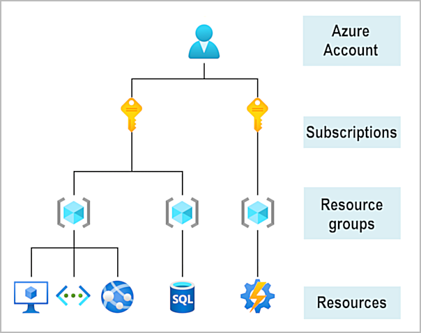

# Introduction to Azure fundamentals

[source](https://docs.microsoft.com/en-us/learn/modules/intro-to-azure-fundamentals)

## Introduction

### Domain areas

AZ-900 Domain Area | Weight
--- | ---
Describe cloud concepts | 20-25%
Describe core Azure services | 15-20%
Describe core solutions and management tools on Azure | 10-15%
Describe general security and network security features | 10-15%
Describe identity, governance, privacy, and compliance features | 20-25%
Describe Azure cost management and Service Level Agreements | 10-15%

## What is cloud computing?

- Cheaper because *pay-as-you-go*  
  - lower operation costs  
  - run infra more efficiently  
  - more scalable  

## What is Azure?

- 100 services  
- [Azure portal](https://portal.azure.com/): Web based portal to manage all Azure services  
- [Azure markerplace](https://azuremarketplace.microsoft.com/): on-demand solutions and services  

## Tour of Azure services

- Compute: VM, Kubernetes, Functions  
- Networking: Virtual network, DNS, VPN, Loadbalancers
- Storage: BLOB, File storage  
- Mobile: Android / iOS backend  
- Database: Cosmos DB, SQL, MySQL, PostgreSQL  
- Web: web hosting  
- IoT: IoT software or edge  
- Big Data: Synapse Analytics, HDInsight, Databricks  
- AI  
- Devops  

## Azure accounts

- Learn sandbox: some exercises can create temporary subscription for the duration of the learn module

## Case study

**Tailwind Traders** manages on-premises datacenter for hosting company's retail website.  

IT department responsible for hardware and software management  

## Knowledge check

1. True or false: You need to purchase an Azure account before you can use any Azure resources.

    - [X] False

    - [ ] True

2. What is meant by cloud computing?

    - [X] Delivery of computing services over the internet.

    - [ ] Setting up your own datacenter.

    - [ ] Using the internet

3. What is not a reason to move to the cloud?

    - [ ] Faster innovation

    - [X] A limited pool of services

    - [ ] Speech recognition and other cognitive services

# Fundamental Azure concepts

## Intro

Work in the IT department for Tailwind Traders, which has decided to migrate its applications and data to Microsoft Azure.  

Learning objectives:  
- Identify the benefits and considerations of using cloud services.  
- Describe the differences between categories of cloud services.  
- Describe the differences between types of cloud computing.  

## Different cloud models

| Public                                | Private                                           | Hybrid                            |
|  ---                                  |   ---                                             |  ---                              |
| * over public Internet                | * on-premises                                     | * combined                        |
| * easily scalable                     | * hardware must be purchased                      | * more flexible                   |
| * quick app provision / deprovision   | * complete control over resources and security    | * choose where app run            |
| * pay-as-you-go                       | * maintenance hardware and security               | * control security, compliance    |

## Cloud benefits

1. Advantages
    - High availability  
    - Scalabitily  
    - Eslaticity  
    - Agility  
    - Geo-distribution  
    - Disaster recovery  

2. Expenses

    - Capital Expenditure (CapEx): up-front cost for physical infra for example  

    - Operational Expenditure (OpEx): expense for services or products and deductable now - Consumption-based model

Cloud computing is a consumption-based model

## Categories of cloud services

